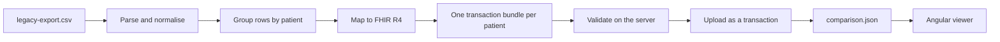

# FHIR Bridge

Takes a CSV export from a legacy clinical system, turns it into valid HL7 FHIR
R4 resources, validates them against a FHIR server, uploads them, and shows
each original row next to the resources it became. The domain is rare diseases,
where a diagnosis needs both an Orphanet code to say what the disease is and an
ICD-10 code for the systems that only speak ICD.

> **Every record in this repository is synthetic.** The rows in
> `data/legacy-export.csv` were written for this project and describe no real
> person. Resources uploaded to the public test server carry the HL7 `HTEST`
> security label, which marks them as test data.

## What it does



1. **Parse** the export, normalising the mess a real export carries: five date
   formats, decimal commas, seven ways of writing a sex, inconsistent units.
2. **Group** the rows of each patient, since the same person appears on more
   than one row, and merge their details without losing information.
3. **Map** each row to a `Patient`, a `Condition` and, when there is a lab
   result, an `Observation`, translating local codes to Orphanet, ICD-10, LOINC
   and UCUM.
4. **Validate** every patient's resources on the server before anything is
   stored.
5. **Upload** each patient as a single transaction, as a conditional update on
   the identifiers the legacy system provides, so running it twice changes
   nothing.
6. **Report** what happened, row by row, for the viewer to show.

## Requirements

- Node.js 24 LTS, or 22.22 or newer. The pipeline alone runs on 22.13; the
  Angular viewer needs the newer versions.
- [gitleaks](https://github.com/gitleaks/gitleaks) for the pre-commit hook that
  scans staged changes for secrets.

## Quick start

```sh
npm install
cp .env.example .env
npm start
```

That reads `data/legacy-export.csv`, validates every patient against
`https://hapi.fhir.org/baseR4` and uploads them. To see what it would do
without storing anything:

```sh
npm start -- --dry-run
```

To map and write the bundles without contacting any server at all:

```sh
npm start -- --offline
```

### The viewer

```sh
npm install --prefix web
npm start --prefix web
```

Then open http://localhost:4200. The viewer reads the `out/comparison.json`
that the pipeline wrote, so run the pipeline first. The data is copied in when
the viewer starts: after running the pipeline again, restart the viewer. The
footer shows when the data on screen was generated.

## The legacy export

`data/legacy-export.csv` is 25 rows written to be awkward on purpose. Every
kind of mess in it exists to exercise one decision in the pipeline, and each
one has a test:

| In the export | Why it is there |
| --- | --- |
| UTF-8 BOM, `;` separator, quoted field containing `;` | A parser that ignores these corrupts the first column or splits a field in two |
| `12/03/1998`, `19871104`, `05-09-2003`, `1994-04-17`, `1998` | Dates arrive in whatever the old system wrote, including year only |
| `31/02/2001`, empty `MRN` | Two rows that cannot be used, to show that one bad row does not stop the rest |
| `M`, `m`, `MALE`, `F`, `f`, `1`, `2`, `U` | `1` and `2` are the ISO 5218 codes |
| `1,25`, `<0.5`, `N/A`, empty | Decimal commas, results below the detection limit, and absent values |
| `mg/dl`, `mg/dL`, `mmol/l`, `mmol/L` | UCUM is case sensitive, so these need repairing |
| `RD-410`, `LB-GBA` | A diagnosis code no standard covers, and a lab test LOINC has no quantitative code for |
| The same `MRN` on two rows | One patient with two diagnoses: the case that a naive import turns into two patients |
| `ONSET_AGE` of `0` | Newborn screening. A FHIR `Age` must be positive, so zero cannot be one |
| Trailing spaces, accented names, missing surname | The everyday untidiness of real data |

Running the pipeline on it gives **22 patients, 23 conditions and 15
observations from 23 usable rows**, with 2 rows rejected and 7 decisions
reported.

## How the mapping works

### Identity, and why a rerun changes nothing

The legacy system gives two identifiers, and neither is a FHIR id:

- `MRN` identifies the **patient**. It becomes `Patient.identifier` with type
  `MR`, in the namespace `http://example.org/fhir/sid/legacy-mrn`.
- `PAT_ID` turns out to identify the **row**, not the person: the same patient
  appears under two different `PAT_ID`s. It becomes the identifier of that
  row's `Condition` and `Observation`.

Every entry of the bundle is a conditional update keyed on its identifier
(`PUT Condition?identifier=<system>|P0001`), so the server creates the resource
the first time and updates it afterwards. Uploading the export twice leaves 22
patients, not 44. This was checked against the public HAPI server: the second
run reported 0 created and 60 updated, and left every resource on version 1.

### One transaction per patient

A patient's `Patient`, `Condition` and `Observation` resources go into a single
`transaction` bundle, referring to each other by the temporary `urn:uuid` of
their entry. The server swaps those for the real ids when it commits, so what
ends up stored is `Condition.subject = Patient/28886`.

That shape was chosen over uploading resources one by one because it means a
patient is stored whole or not at all, and because it lets the whole set be
validated before anything is written: a `Condition` that refers to a `Patient`
that does not exist yet fails validation, which is exactly what happens if the
resources are validated separately.

### Terminology

Every code, display and system URI was checked against a source rather than
written from memory:

| Code system | URI | Checked against |
| --- | --- | --- |
| ICD-10 (WHO) | `http://hl7.org/fhir/sid/icd-10` | The FHIR R4 specification, and `$lookup` on tx.fhir.org |
| Orphanet | `https://www.orpha.net` | The HL7 Terminology external code system registry; ORPHAcodes from ORDO through the EBI Ontology Lookup Service |
| LOINC | `http://loinc.org` | `$expand` against LOINC 2.82 on tx.fhir.org |
| UCUM | `http://unitsofmeasure.org` | `$validate-code` on tx.fhir.org |

`src/terminology/code-map.json` holds the table and records where each value
came from. Two entries have no standard code on purpose, and say why in the
file itself.

ICD-10 files both Fabry disease and Gaucher disease under `E75.2`, *Other
sphingolipidosis*. Orphanet tells them apart, `324` and `77259`. Each
`Condition.code` therefore carries three codings that all mean the same thing:
Orphanet, ICD-10, and the legacy code, so a resource can still be traced back
to the row it came from.

### Decisions worth knowing

| Situation | What the pipeline does | Why |
| --- | --- | --- |
| A row records only a birth year | Keeps `1998` as the `birthDate` | FHIR dates may be partial, and padding it to a first of January would invent clinical data |
| Two rows of one patient disagree on a date | The more precise value wins when they agree (`1998` and `1998-03-12`), otherwise the earlier row wins and the contradiction is reported | Keep as much information as the rows hold between them, and never silently pick a side |
| A timestamp has a time but no zone | Assumes UTC, configurable with `SOURCE_TIMEZONE_OFFSET` | A FHIR `dateTime` that states a time must state its offset. The assumption is written down rather than hidden |
| A result reads `<0.5` | `valueQuantity` with `comparator` `<` | FHIR models a detection limit as a comparator, not as text |
| `ONSET_AGE` is `0` | `onsetString: "0 years"` | A FHIR `Age` must be positive (invariant `age-1`). The value is still information, so it is kept in the text form of `onset[x]` rather than dropped |
| A name is written `NOVAK` | Left exactly as it is | Tidying case looks harmless until a `McDonald` or a `van der Berg` goes through it |
| A diagnosis code has no standard mapping | Keeps the local code and reports it | Better an honest local code than a standard one that means something else |
| A row cannot be used at all | Rejected on its own, with a reason, and the run continues | One bad row in a hospital export should not stop the other twenty-four |

Failures are separated into three levels: the **file** cannot be read (wrong
header, empty file) and the run stops; a **row** lacks its identity or its
clinical core and is rejected with a reason; something **secondary** is
unusable, such as a lab value, and only that part is dropped, with a warning.

## Why FHIR R4

R5 is the latest published FHIR release. This project targets R4 (4.0.1) on
purpose.

- **The project is about migration, and migrated data has to land somewhere.**
  Receiving systems in production today speak R4: US Core, the profile set that
  US interoperability regulation points to, is built on R4, as is the
  International Patient Summary, and so is the HL7 Europe implementation guide
  consulted for Orphanet coding while building the terminology table.
- **R5 saw limited adoption.** Much of the community plans to move from R4
  straight to R6, which is currently going through ballot.
- **The choice is cheap to revisit.** For the three resources used here, the
  only relevant difference is in `Condition`: R5 makes `clinicalStatus`
  mandatory and replaces `recorder` and `asserter` with `participant`. The code
  systems and the terminology table do not change.

## What validation does and does not check

Each bundle is sent to the server's `$validate` operation before it is
uploaded. That checks structure, cardinalities, datatypes and invariants, and
it caught a real bug during development: an `Age` of zero, which FHIR does not
allow.

It does **not** check the codes. The public HAPI server has no terminology
loaded, so it reports LOINC, ICD-10 and Orphanet alike as *"CodeSystem is
unknown and can't be validated"*. The codes in this project are verified
separately, against the sources listed above, and held in place by tests.

Two best-practice warnings are expected and accepted: resources carry no
narrative (`dom-6`), and observations have no `performer`, because the export
does not record who ran the test. Generating a narrative from free-text fields
would add an escaping risk for no real gain here.

## Command line

```
npm start -- [options]

  --dry-run   validate against the server but store nothing (same as DRY_RUN=true)
  --offline   map and write the bundles without contacting the server at all
  --help      show this message
```

Unknown options are an error rather than something to skip: a mistyped
`--offline` that was quietly ignored would turn a run meant to stay local into
one that uploads.

| Exit code | Meaning |
| --- | --- |
| 0 | Everything got through. Rejected rows do not fail the run: turning a bad row away with a reason is the designed behaviour |
| 1 | A patient failed validation, or the server refused one |
| 2 | The command line, the configuration or the export was unusable |
| 3 | The server could not be reached, or answered in something other than FHIR |

## Configuration

Copy `.env.example` to `.env`. Nothing secret is needed for the public test
server; the token is there for a protected one.

| Variable | Default | Purpose |
| --- | --- | --- |
| `FHIR_BASE_URL` | `https://hapi.fhir.org/baseR4` | The server to validate against and upload to |
| `FHIR_AUTH_TOKEN` | empty | Bearer token, when the server needs one |
| `LEGACY_CSV_PATH` | `data/legacy-export.csv` | The export to read |
| `OUTPUT_DIR` | `out` | Where the run writes its files |
| `REQUEST_TIMEOUT_MS` | `30000` | Deadline for every request |
| `DRY_RUN` | `false` | Validate without storing |
| `SOURCE_TIMEZONE_OFFSET` | `Z` | Zone assumed for timestamps that carry none |

## What a run writes

| File | Contents |
| --- | --- |
| `out/bundles/<MRN>.json` | The transaction bundle built for each patient |
| `out/parse-report.json` | Rejected rows and every warning raised |
| `out/results.json` | What the server said and did for each patient |
| `out/comparison.json` | Every row next to the resources it became, for the viewer |

## Tests

```sh
npm test               # 389 tests
npm run test:coverage  # coverage report in coverage/
npm test --prefix web  # 13 tests for the viewer
```

The parser, the terminology table and the mapper are the core of the project
and are covered accordingly, edge cases included. Two things worth pointing
out about how they are tested:

- The tests for the FHIR client run against **recorded responses from the real
  HAPI server**, in `tests/fixtures/hapi/`, rather than against invented ones.
- The pipeline is tested end to end against a fake server, which is possible
  because `runPipeline` neither prints nor touches the file system.

## Project layout

```
src/
  legacy/        reading the export: types, parser, normalisers
  terminology/   the code table and its lookups
  fhir/          mapping, bundles, the client, the uploader
  report/        the files a run writes
  pipeline.ts    the run itself, with no printing and no file access
  cli.ts         arguments and output
data/            the synthetic export
tests/           tests, fixtures and recorded server responses
web/             the Angular viewer
```

## Limitations, and what would come next

- **The target is a public server shared with everyone.** Anyone running this
  writes to the same identifiers, so two people running it at once would be
  updating each other's resources. A real deployment would point at its own
  server.
- **No retries.** A request that fails stops the run, which is safe because
  every upload is a conditional update: starting again is enough.
- **No profile is claimed.** The resources are plain R4, validated against the
  base specification. Targeting a published profile, such as US Core or a
  European rare disease guide, would be the natural next step.
- **Patients are uploaded one at a time.** Twenty-two requests do not need
  concurrency, and the target is a shared public server.
